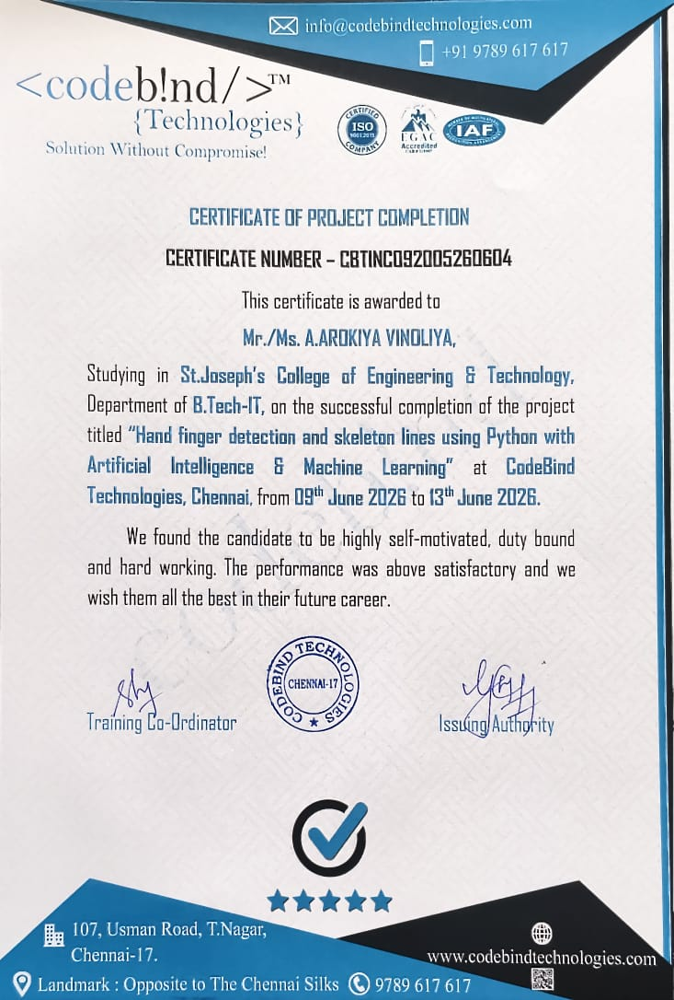

# 🤚 Hand Finger Detection & Skeleton Lines

## 📌 About

A collaborative project developed during my internship at **CodeBind Technologies, Chennai**. 🏢

The project focuses on detecting hand fingers 🤚 and visualizing skeleton lines 🦴 using **Python 🐍, Artificial Intelligence 🤖 and Machine Learning 🧠**.

## 🛠️ Technologies Used

- 🐍 Python
- 🤖 Artificial Intelligence
- 🧠 Machine Learning
- 👁️ Computer Vision

## 👥 Project Type

**Collaborative Team Project** 🤝

## 🏢 Internship

**CodeBind Technologies, Chennai**  
📅 9 June 2026 – 13 June 2026

## 🎯 Project Goal

To detect hand fingers and visualize hand skeleton lines using AI/ML-based techniques. 🤚✨
## 🏆 Certificate

Successfully completed the project internship at CodeBind Technologies, Chennai.

**Project:** Hand Finger Detection and Skeleton Lines using Python with Artificial Intelligence & Machine Learning

**Duration:** 9 June 2026 – 13 June 2026

